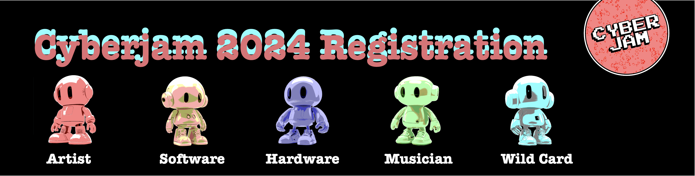

# Cyberjam 2024 🚀  
A One-of-a-Kind Collaborative Hackathon



## Overview

**Cyberjam 2024** is a unique hackathon experience designed to foster **multidisciplinary collaboration** among artists, developers, musicians, and technologists. Teams of 5 will come together to create immersive **2D & 3D physical + digital (phygital)** experiences across five thematic tracks:

- **Governance 🏫**
- **Fashion 💃**
- **Security & Privacy 🔒**
- **Sports + Gaming 🎮**
- **AI 🤖**

Cyberjam will take place **October 19th - October 27th** at **Chicago 1871**, culminating in an unforgettable **Closing Ceremony & Showcase**. Participants will push the boundaries of innovation, collaborating on projects that combine art, technology, and real-world applications.

---

## Table of Contents

- [Getting Started](#getting-started)
- [Tech Stack](#tech-stack)
- [Project Structure](#project-structure)
- [Scripts](#scripts)
- [Deployment](#deployment)
- [Contributing](#contributing)
- [License](#license)

---

## Getting Started

Follow these instructions to get a copy of the project running on your local machine.

### Prerequisites

Ensure you have the following installed:
- **Node.js** (v14 or higher)
- **npm** (v6 or higher)
- **Git**

### Installation

1. Clone the repository:

   ```bash
   git clone https://github.com/your-github-username/cyberjam.git
   ```

2. Navigate to the project directory:

   ```bash
   cd cyberjam
   ```

3. Install the dependencies:

   ```bash
   npm install
   ```

4. Start the development server:

   ```bash
   npm start
   ```

This will open the project in your default browser at `http://localhost:3000`.

---

## Tech Stack

- **React.js**: Frontend framework for building interactive UI components.
- **TailwindCSS**: Utility-first CSS framework for styling.
- **gh-pages**: To deploy the app to GitHub Pages.

---

## Project Structure

The project follows a simple structure:

```
cyberjam/
│
├── src/
│   ├── App.js            # Main React component
│   ├── index.js          # React entry point
│   └── components/       # Additional components (navbar, sections, etc.)
│
├── public/
│   └── index.html        # Main HTML file
│
├── tailwind.config.js     # TailwindCSS configuration
├── package.json           # Project dependencies and scripts
└── README.md              # Project documentation
```

### Main Sections

- **Navbar**: Sticky navigation that smooth-scrolls to the different sections of the page.
- **Home**: Introduction to Cyberjam 2024.
- **About**: Details about the hackathon, including themes and objectives.
- **Sponsors**: Highlight of sponsor benefits and opportunities.
- **Register**: Call to action for participants to register.

---

## Scripts

In the project directory, you can run:

- **`npm start`**: Runs the app in development mode. Open [http://localhost:3000](http://localhost:3000) to view it in the browser.
- **`npm run build`**: Builds the app for production to the `build/` folder. It correctly bundles React in production mode and optimizes the build for the best performance.
- **`npm run deploy`**: Deploys the app to GitHub Pages. Ensure the `homepage` in `package.json` is correctly set up.

---

## Deployment

This project is deployed using **GitHub Pages**. To deploy your own version:

1. Ensure your `package.json` has the correct `homepage` field set:

   ```json
   "homepage": "https://your-github-username.github.io/cyberjam/"
   ```

2. Run the deployment script:

   ```bash
   npm run deploy
   ```

3. The site will be available at `https://your-github-username.github.io/cyberjam/`.

---

## Contributing

We welcome contributions from developers and designers passionate about shaping the future of immersive hackathons! Here’s how you can contribute:

1. Fork the repository.
2. Create your feature branch (`git checkout -b feature/AmazingFeature`).
3. Commit your changes (`git commit -m 'Add some AmazingFeature'`).
4. Push to the branch (`git push origin feature/AmazingFeature`).
5. Open a pull request.

### Code Style

We follow best practices in React and TailwindCSS. Make sure to lint your code before submitting.

---

## License

This project is licensed under the MIT License - see the [LICENSE](LICENSE) file for details.

---

### Contact

For any queries or collaboration opportunities, email us at cyberjam.art@gmail.com!